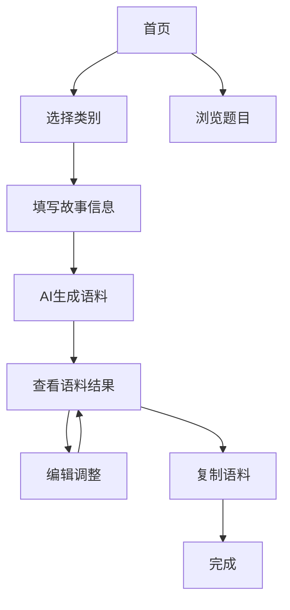

# 雅思串题助手产品需求文档

## 1. 产品概述
雅思串题助手是一款基于AI的口语备考工具，帮助中国学生用自己的故事生成定制化语料，降低雅思口语Part 2的背诵门槛。通过将题库按人物、事物、地点、经历四大类别分类，用户只需填写简单信息即可生成适用于多道题目的串题语料。

产品解决传统串题资料需要背诵大量陌生故事的痛点，让学生用熟悉的个人经历应对考试，提高记忆效果和临场应变能力。

## 2. 核心功能

### 2.1 用户角色
本产品为单用户应用，无需区分用户角色。

### 2.2 功能模块
产品包含以下核心页面：
1. **首页**：题季选择、四大类别导航
2. **故事填写页**：分类别的信息输入表单
3. **语料生成页**：AI生成结果展示和编辑
4. **题目浏览页**：查看当前题季所有题目

### 2.3 页面详情

| 页面名称 | 模块名称 | 功能描述 |
|---------|---------|----------|
| 首页 | 题季选择器 | 显示当前题季(2025年5-8月)，支持切换不同题季 |
| 首页 | 类别导航 | 四个分类卡片：人物类、事物类、地点类、经历类，显示每类题目数量 |
| 首页 | 统计概览 | 显示总题目数、正负向题目分布等统计信息 |
| 故事填写页 | 类别框架表单 | 根据选择类别显示对应的信息填写字段，支持正面和负面故事 |
| 故事填写页 | 表单验证 | 必填字段验证，提供填写提示和示例 |
| 故事填写页 | 生成按钮 | 提交表单数据，触发AI语料生成 |
| 语料生成页 | 通用语料展示 | 显示基于用户输入生成的通用故事内容 |
| 语料生成页 | 题目语料列表 | 展示该类别下每道题目的定制化语料，高亮扣题部分 |
| 语料生成页 | 语料编辑 | 支持选中文本进行AI重新生成，区分通用语料和扣题语料 |
| 语料生成页 | 复制功能 | 一键复制语料内容，支持单题复制和批量复制 |
| 题目浏览页 | 题目分类展示 | 按四大类别展示所有题目，支持中英文对照 |
| 题目浏览页 | 题目搜索 | 支持关键词搜索题目内容 |

## 3. 核心流程

用户使用流程如下：
1. 进入首页，查看当前题季和题目统计
2. 选择要准备的故事类别（人物/事物/地点/经历）
3. 填写该类别的框架信息，包括正面和负面故事
4. 点击生成，AI处理用户输入并生成语料
5. 查看生成结果，包括通用语料和各题目的定制语料
6. 根据需要编辑调整语料内容
7. 复制满意的语料用于备考练习

## 4. 用户界面设计

### 4.1 设计风格
- 主色调：蓝色系(#2563eb)，辅助色：绿色(#10b981)
- 按钮风格：圆角现代风格，悬停效果
- 字体：中文使用思源黑体，英文使用Inter，主要字号14-16px
- 布局风格：卡片式设计，顶部导航，响应式布局
- 图标风格：线性图标，简洁现代

### 4.2 页面设计概览

| 页面名称 | 模块名称 | UI元素 |
|---------|---------|--------|
| 首页 | 题季选择器 | 下拉选择框，当前题季高亮显示 |
| 首页 | 类别卡片 | 4个网格布局卡片，包含图标、标题、题目数量，悬停效果 |
| 首页 | 统计面板 | 数据卡片展示，使用图表可视化 |
| 故事填写页 | 表单区域 | 分步骤表单，进度指示器，字段标签和提示文本 |
| 语料生成页 | 语料卡片 | 可折叠卡片，通用语料和扣题语料不同背景色 |
| 语料生成页 | 编辑工具 | 浮动工具栏，包含编辑、复制、重新生成按钮 |

### 4.3 响应式设计
产品采用移动优先的响应式设计，支持桌面端和移动端使用，针对触屏操作进行优化。