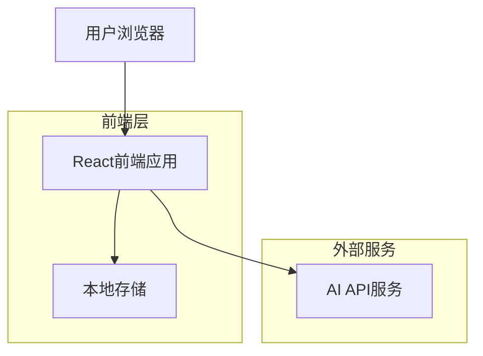
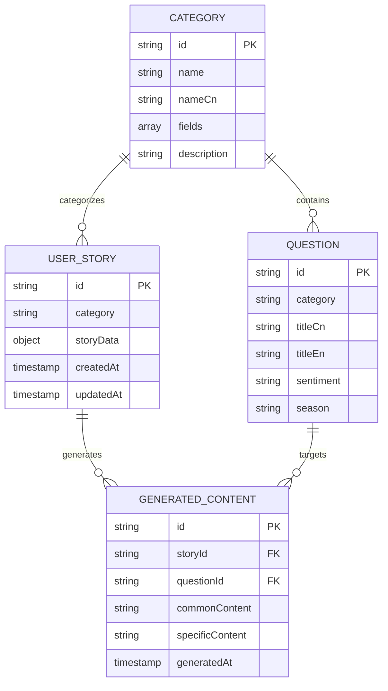

# 雅思串题助手技术架构文档

## 1. 架构设计



## 2. 技术描述

* 前端：React\@18 + TypeScript + Tailwind CSS + Vite

* 状态管理：Zustand

* AI服务：OpenAI API (GPT-4)

* 数据存储：LocalStorage (用户故事和生成的语料)

* 部署：Vercel/Netlify

## 3. 路由定义

| 路由                   | 用途                |
| -------------------- | ----------------- |
| /                    | 首页，显示题季选择和四大类别导航  |
| /category/:type      | 故事填写页，根据类别显示对应表单  |
| /generate/:type      | 语料生成页，展示AI生成的语料内容 |
| /questions           | 题目浏览页，查看当前题季所有题目  |
| /questions/:category | 分类题目页，查看特定类别的题目   |

## 4. API定义

### 4.1 核心API

AI语料生成相关

```
POST /api/generate-content
```

请求参数：

| 参数名称       | 参数类型   | 是否必需  | 描述                                 |
| ---------- | ------ | ----- | ---------------------------------- |
| category   | string | true  | 故事类别：person/thing/place/experience |
| storyData  | object | true  | 用户填写的故事信息                          |
| questionId | string | false | 特定题目ID，用于生成扣题语料                    |

响应参数：

| 参数名称                 | 参数类型    | 描述      |
| -------------------- | ------- | ------- |
| success              | boolean | 请求是否成功  |
| data                 | object  | 生成的语料内容 |
| data.commonContent   | string  | 通用语料    |
| data.specificContent | string  | 扣题语料    |

请求示例：

```json
{
  "category": "person",
  "storyData": {
    "identity": "大学室友",
    "relationship": "大一同班，室友三年",
    "appearance": "总是戴棒球帽",
    "personality": "非常乐观外向",
    "event": "我们一起策划了学校的慈善义卖",
    "feeling": "他让我觉得生活中保持乐观很重要"
  }
}
```

语料编辑相关

```
POST /api/edit-content
```

请求参数：

| 参数名称            | 参数类型   | 是否必需 | 描述                   |
| --------------- | ------ | ---- | -------------------- |
| originalContent | string | true | 原始语料内容               |
| editInstruction | string | true | 编辑指令                 |
| contentType     | string | true | 内容类型：common/specific |

## 5. 数据模型

### 5.1 数据模型定义



### 5.2 数据结构定义

用户故事数据结构

```typescript
interface UserStory {
  id: string;
  category: 'person' | 'thing' | 'place' | 'experience';
  storyData: PersonStory | ThingStory | PlaceStory | ExperienceStory;
  createdAt: Date;
  updatedAt: Date;
}

interface PersonStory {
  identity: string;        // 人物身份
  relationship: string;    // 与我的关系
  appearance?: string;     // 外貌特点
  personality: string;     // 性格特点
  event: string;          // 共同经历的事件
  feeling: string;        // 我的感受
}

interface ThingStory {
  name: string;           // 事物名称
  firstTime: string;      // 第一次接触时间
  firstPlace: string;     // 第一次接触地点
  firstEvent: string;     // 第一次接触时发生的事
  features: string;       // 外观或特征
  reason: string;         // 喜欢的原因
  experience: string;     // 相关经历
  impact: string;         // 对我的影响
}

interface PlaceStory {
  name: string;           // 地点名称
  type: string;           // 地点类型
  firstVisit: string;     // 第一次去的时间和原因
  environment: string;    // 环境特征
  activities: string;     // 在那里的活动
  companions: string;     // 与谁一起去
  reason: string;         // 喜欢的原因
}

interface ExperienceStory {
  theme: string;          // 事件主题
  time: string;           // 发生时间
  place: string;          // 发生地点
  participants: string;   // 参与者
  process: string;        // 事情经过
  learning: string;       // 学到的东西/感受
}
```

题目数据结构

```typescript
interface Question {
  id: string;
  category: 'person' | 'thing' | 'place' | 'experience';
  titleCn: string;        // 中文题目
  titleEn: string;        // 英文题目
  sentiment: 'positive' | 'negative';  // 情感倾向
  season: string;         // 题季
  keywords?: string[];    // 关键词
}
```

生成内容数据结构

```typescript
interface GeneratedContent {
  id: string;
  storyId: string;
  questionId: string;
  commonContent: string;     // 通用语料
  specificContent: string;   // 扣题语料
  generatedAt: Date;
  editHistory?: EditRecord[];
}

interface EditRecord {
  timestamp: Date;
  instruction: string;
  beforeContent: string;
  afterContent: string;
}
```

## 6. 组件架构

### 6.1 组件层次结构

```
App
├── Layout
│   ├── Header (题季选择器)
│   ├── Navigation
│   └── Footer
├── Pages
│   ├── HomePage
│   │   ├── SeasonSelector
│   │   ├── CategoryGrid
│   │   └── StatsPanel
│   ├── CategoryPage
│   │   ├── StoryForm
│   │   ├── FormValidation
│   │   └── GenerateButton
│   ├── GeneratePage
│   │   ├── CommonContentCard
│   │   ├── QuestionContentList
│   │   ├── EditToolbar
│   │   └── CopyButton
│   └── QuestionsPage
│       ├── CategoryTabs
│       ├── QuestionList
│       └── SearchBox
└── Components
    ├── UI (Button, Card, Input, etc.)
    ├── Forms (StoryFormFields)
    ├── Content (ContentEditor, ContentViewer)
    └── Utils (LoadingSpinner, ErrorBoundary)
```

### 6.2 状态管理

使用Zustand进行状态管理：

```typescript
interface AppState {
  // 当前题季
  currentSeason: string;
  
  // 题目数据
  questions: Question[];
  
  // 用户故事
  userStories: UserStory[];
  
  // 生成的内容
  generatedContents: GeneratedContent[];
  
  // UI状态
  isLoading: boolean;
  error: string | null;
  
  // Actions
  setCurrentSeason: (season: string) => void;
  addUserStory: (story: UserStory) => void;
  updateUserStory: (id: string, story: Partial<UserStory>) => void;
  generateContent: (storyId: string, questionId?: string) => Promise<void>;
  editContent: (contentId: string, instruction: string) => Promise<void>;
}
```

