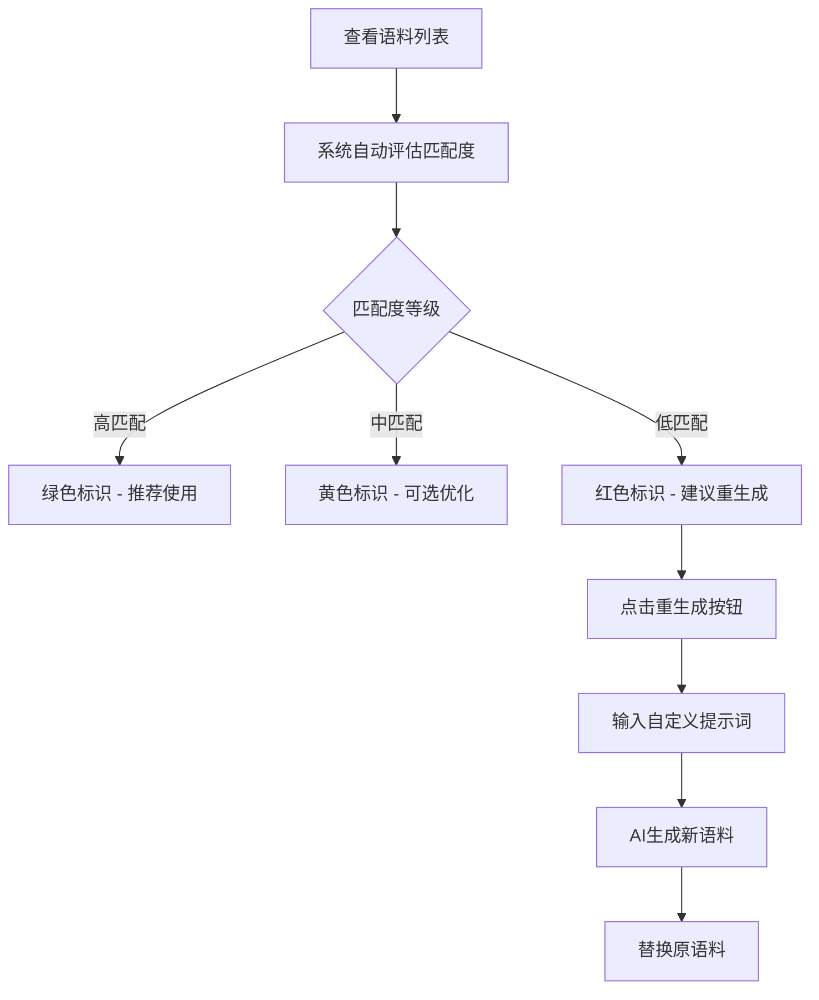

# 雅思串题助手功能增强需求文档

## 1. 项目概述

### 1.1 项目功能总结

雅思串题助手是一个基于AI驱动的雅思口语Part 2语料生成工具，旨在帮助考生高效准备口语考试。

**核心功能模块：**
- **故事填写系统**：支持四大类别（人物、事物、地点、经历）的双情绪（正面/负面）故事填写
- **AI语料生成**：基于OpenAI GPT-4生成通用语料和扣题语料
- **语料管理**：支持语料编辑、复制、分类展示和本地存储
- **题库管理**：包含2025年5-8月题季的完整题库，支持正向51道和负向8道题目
- **统计面板**：提供语料生成统计和题目分布数据

**技术架构：**
- 前端：React 18 + TypeScript + Tailwind CSS + Vite
- 状态管理：Zustand
- AI服务：OpenAI GPT-4 API
- 数据存储：LocalStorage本地持久化
- 部署：Vercel云平台

**核心特性：**
- 纯前端应用，无需后端服务器
- 支持情绪化语料生成，匹配题目情感倾向
- 智能差异高亮，展示通用语料与扣题语料的区别
- 响应式设计，支持移动端和桌面端

## 2. 功能增强需求

### 2.1 语料中文翻译功能

#### 2.1.1 需求描述
为每段生成的英文语料提供准确的中文翻译，帮助用户更好地理解语料内容，提升学习效果。

#### 2.1.2 功能特性
- **自动翻译**：语料生成时同步生成中文翻译
- **翻译展示**：在语料卡片中添加中英文切换功能
- **翻译编辑**：支持用户手动编辑翻译内容
- **翻译复制**：支持单独复制中文翻译或中英文对照

#### 2.1.3 用户交互设计
- 在ContentCard组件中添加"中/英"切换按钮
- 默认显示英文语料，点击切换显示中文翻译
- 提供"复制英文"、"复制中文"、"复制对照"三个选项
- 编辑模式下同时支持英文和中文内容编辑

#### 2.1.4 技术实现方案
```typescript
// 扩展GeneratedContent接口
interface GeneratedContent {
  // ... 现有字段
  commonContentCn?: string;     // 通用语料中文翻译
  specificContentCn?: string;   // 扣题语料中文翻译
  translationSource: 'ai' | 'manual'; // 翻译来源
}

// 新增翻译相关API
interface TranslationAPI {
  translateContent(content: string): Promise<string>;
  updateTranslation(contentId: string, translation: string): Promise<void>;
}
```

### 2.2 通用语料匹配度检测与重新生成功能

#### 2.2.1 需求描述
检测通用语料与具体题目的匹配度，对匹配度较差的题目进行标识，并提供针对性的重新生成功能。

#### 2.2.2 功能特性
- **匹配度评估**：使用AI分析通用语料与题目的相关性
- **智能分类**：将题目分为"高匹配"、"中匹配"、"低匹配"三个等级
- **视觉标识**：用不同颜色和图标标识匹配度等级
- **快速重生成**：一键重新生成低匹配度题目的专属语料
- **自定义提示**：用户可输入额外提示词优化生成效果

#### 2.2.3 匹配度评估标准
- **高匹配（90-100%）**：通用语料完全适用，无需调整
- **中匹配（70-89%）**：基本适用，可能需要微调
- **低匹配（<70%）**：匹配度差，建议重新生成

#### 2.2.4 用户交互流程


#### 2.2.5 技术实现方案

**数据结构扩展：**
```typescript
// 匹配度评估结果
interface MatchingScore {
  questionId: string;
  score: number;           // 0-100的匹配分数
  level: 'high' | 'medium' | 'low';
  reasons: string[];       // 评估理由
  suggestions: string[];   // 改进建议
  lastEvaluated: Date;
}

// 扩展GeneratedContent
interface GeneratedContent {
  // ... 现有字段
  matchingScore?: MatchingScore;
  regenerationHistory?: RegenerationRecord[];
}

// 重生成记录
interface RegenerationRecord {
  timestamp: Date;
  userPrompt: string;
  originalContent: string;
  newContent: string;
  reason: string;
}
```

**核心组件设计：**

1. **MatchingIndicator组件**
```typescript
interface MatchingIndicatorProps {
  score: number;
  level: 'high' | 'medium' | 'low';
  onRegenerate?: () => void;
}
```

2. **RegenerationModal组件**
```typescript
interface RegenerationModalProps {
  questionId: string;
  currentContent: string;
  onRegenerate: (prompt: string) => Promise<void>;
  onClose: () => void;
}
```

3. **MatchingEvaluator服务**
```typescript
class MatchingEvaluator {
  async evaluateMatching(
    commonContent: string, 
    question: Question
  ): Promise<MatchingScore>;
  
  async regenerateContent(
    story: UserStory,
    questionId: string,
    userPrompt: string
  ): Promise<string>;
}
```

## 3. 实现优先级

### 3.1 第一阶段：语料翻译功能
- 扩展数据模型支持中文翻译
- 集成翻译API（OpenAI或专业翻译服务）
- 更新ContentCard组件支持中英文切换
- 实现翻译内容的编辑和存储

### 3.2 第二阶段：匹配度检测
- 开发匹配度评估算法
- 实现MatchingIndicator组件
- 集成评估结果到语料展示界面
- 添加匹配度筛选和排序功能

### 3.3 第三阶段：智能重生成
- 开发RegenerationModal组件
- 实现自定义提示词功能
- 添加重生成历史记录
- 优化AI提示词模板

## 4. 用户体验优化

### 4.1 界面设计原则
- **直观性**：匹配度用颜色和图标直观展示
- **便捷性**：一键切换中英文，一键重生成
- **反馈性**：实时显示处理状态和结果
- **一致性**：保持与现有界面风格统一

### 4.2 性能优化
- **懒加载**：匹配度评估按需进行
- **缓存机制**：翻译结果本地缓存
- **批量处理**：支持批量评估和翻译
- **错误处理**：网络异常时的降级方案

## 5. 技术风险与解决方案

### 5.1 API调用成本
**风险**：翻译和匹配度评估增加API调用次数
**解决方案**：
- 实现智能缓存机制
- 提供离线翻译选项
- 优化提示词减少token消耗

### 5.2 响应速度
**风险**：实时翻译和评估可能影响用户体验
**解决方案**：
- 异步处理，不阻塞主流程
- 提供加载状态指示
- 支持后台批量处理

### 5.3 数据一致性
**风险**：新增字段可能导致数据迁移问题
**解决方案**：
- 向后兼容的数据结构设计
- 渐进式数据迁移策略
- 完善的错误恢复机制

## 6. 验收标准

### 6.1 功能验收
- [ ] 语料生成时自动生成中文翻译
- [ ] 支持中英文内容切换和编辑
- [ ] 自动评估语料与题目匹配度
- [ ] 提供匹配度可视化标识
- [ ] 支持低匹配度语料的重新生成
- [ ] 用户可输入自定义提示词

### 6.2 性能验收
- [ ] 翻译响应时间 < 3秒
- [ ] 匹配度评估时间 < 2秒
- [ ] 重生成语料时间 < 5秒
- [ ] 界面操作响应时间 < 500ms

### 6.3 用户体验验收
- [ ] 界面操作直观易懂
- [ ] 错误提示清晰明确
- [ ] 支持移动端操作
- [ ] 数据持久化可靠