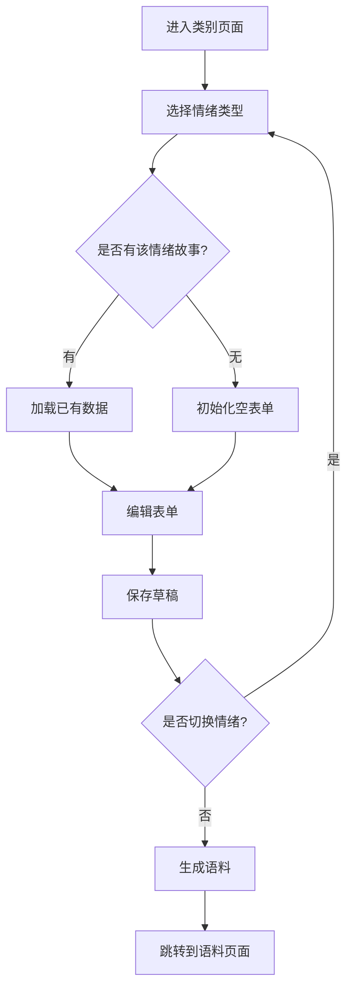
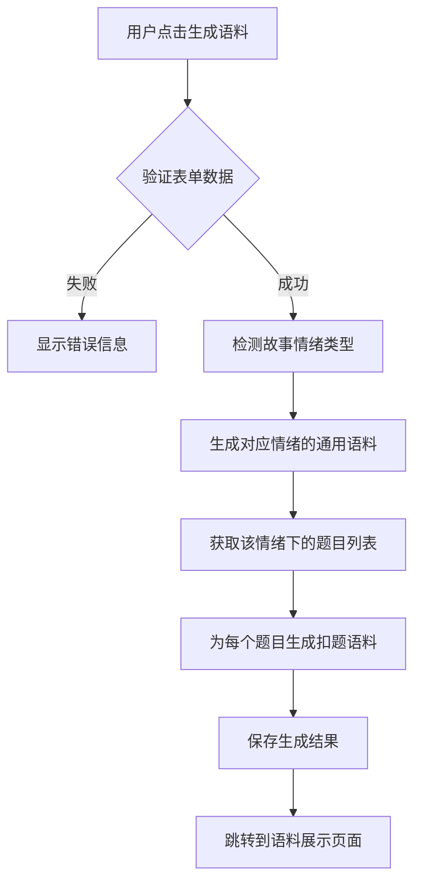

# 雅思串题助手 - 情绪分类故事填写功能架构设计

## 1. 功能概述

### 1.1 需求背景
- 当前题库包含59道题目，其中正向题目51道，负向题目8道
- 现有表单只支持填写一个故事，无法针对不同情绪类别的题目生成适配语料
- 用户需要能够为每个类别填写正面印象和负面印象两种故事

### 1.2 功能目标
- 支持用户为每个类别（人物/事物/地点/经历）填写两种情绪的故事
- 基于不同情绪的故事生成对应的通用语料和扣题语料
- 提供直观的情绪切换界面和双故事管理功能

## 2. 数据模型设计

### 2.1 类型定义扩展

```typescript
// 情绪类型
export type SentimentType = 'positive' | 'negative';

// 情绪化故事数据结构
export interface SentimentStoryData {
  positive?: Record<string, string>;  // 正面印象故事
  negative?: Record<string, string>;  // 负面印象故事
}

// 用户故事接口更新
export interface UserStory {
  id: string;
  category: CategoryType;
  storyData: SentimentStoryData;  // 替换原有的Record<string, string>
  createdAt: Date;
  updatedAt: Date;
}

// 生成内容接口更新
export interface GeneratedContent {
  id: string;
  storyId: string;
  questionId: string;
  sentiment: SentimentType;  // 新增情绪标识
  commonContent: string;
  specificContent: string;
  type: 'general' | 'specific';
  generatedAt: Date;
  createdAt: Date;
  updatedAt: Date;
  editHistory?: EditRecord[];
}
```

### 2.2 数据迁移策略

```typescript
// 现有数据迁移函数
function migrateUserStories(oldStories: OldUserStory[]): UserStory[] {
  return oldStories.map(story => ({
    ...story,
    storyData: {
      positive: story.storyData,  // 将现有数据作为正面故事
      negative: undefined
    }
  }));
}
```

## 3. 组件架构设计

### 3.1 表单组件重构

#### CategoryPage 组件更新
```typescript
interface CategoryPageState {
  currentSentiment: SentimentType;  // 当前选中的情绪
  formData: {
    positive: Record<string, string>;
    negative: Record<string, string>;
  };
  validationErrors: {
    positive: Record<string, string>;
    negative: Record<string, string>;
  };
}
```

#### 情绪切换组件
```typescript
interface SentimentSwitcherProps {
  currentSentiment: SentimentType;
  onSentimentChange: (sentiment: SentimentType) => void;
  hasPositiveData: boolean;
  hasNegativeData: boolean;
}
```

#### 表单字段组件更新
- PersonForm、ThingForm、PlaceForm、ExperienceForm 组件需要支持情绪参数
- 每个表单组件接收 `sentiment` 属性来区分当前编辑的情绪类型

### 3.2 UI/UX 设计

#### 情绪切换界面
- 顶部标签页设计：「正面印象故事」和「负面印象故事」
- 标签页显示填写状态：已填写/未填写
- 切换时保存当前表单数据

#### 表单状态指示
- 每个情绪标签显示填写进度（如：5/7 字段已填写）
- 必填字段验证分别针对两种情绪进行
- 保存草稿和生成语料按钮状态独立管理

## 4. 状态管理更新

### 4.1 Store 接口扩展

```typescript
export interface AppState {
  // 现有字段...
  
  // 新增方法
  addSentimentStory: (story: UserStory, sentiment: SentimentType, data: Record<string, string>) => void;
  updateSentimentStory: (id: string, sentiment: SentimentType, data: Partial<Record<string, string>>) => void;
  generateSentimentContent: (storyId: string, sentiment: SentimentType, questionId?: string) => Promise<void>;
  getSentimentQuestions: (category: CategoryType, sentiment: SentimentType) => Question[];
}
```

### 4.2 语料生成逻辑更新

```typescript
// 情绪化语料生成函数
async function generateSentimentContent(
  storyId: string, 
  sentiment: SentimentType, 
  questionId?: string
): Promise<void> {
  const story = getUserStory(storyId);
  const sentimentStoryData = story.storyData[sentiment];
  
  if (!sentimentStoryData) {
    throw new Error(`未找到${sentiment === 'positive' ? '正面' : '负面'}印象故事数据`);
  }
  
  // 调用AI生成服务
  const result = await openaiGenerateContent({
    category: story.category,
    storyData: sentimentStoryData,
    sentiment,
    questionId
  });
  
  // 保存生成结果
  const content: GeneratedContent = {
    id: generateId(),
    storyId,
    questionId: questionId || '',
    sentiment,
    commonContent: result.commonContent,
    specificContent: result.specificContent,
    type: questionId ? 'specific' : 'general',
    generatedAt: new Date(),
    createdAt: new Date(),
    updatedAt: new Date()
  };
  
  addGeneratedContent(content);
}
```

## 5. AI 生成服务更新

### 5.1 提示词优化

```typescript
// 情绪化通用语料生成提示词
function generateSentimentCommonPrompt(
  category: CategoryType,
  storyData: Record<string, string>,
  sentiment: SentimentType
): string {
  const sentimentDesc = sentiment === 'positive' ? '正面积极' : '负面消极';
  
  return `
请基于以下${sentimentDesc}的${category}类故事，生成一段通用的雅思口语Part 2语料：

故事信息：
${Object.entries(storyData).map(([key, value]) => `${key}: ${value}`).join('\n')}

要求：
1. 语料应体现${sentimentDesc}的情绪色彩
2. 适用于该类别下所有${sentimentDesc}题目
3. 包含丰富的细节描述和个人感受
4. 语言自然流畅，符合雅思评分标准
`;
}

// 情绪化扣题语料生成提示词
function generateSentimentSpecificPrompt(
  commonContent: string,
  question: Question,
  sentiment: SentimentType
): string {
  return `
请基于以下通用语料，针对具体题目进行调整优化：

通用语料：
${commonContent}

目标题目：
${question.titleCn}
${question.titleEn}

要求：
1. 保持${sentiment === 'positive' ? '正面积极' : '负面消极'}的情绪基调
2. 针对题目要求进行内容调整
3. 确保语料完全贴合题目要求
4. 保持语言的自然性和流畅性
`;
}
```

## 6. 用户交互流程

### 6.1 故事填写流程



### 6.2 语料生成流程



## 7. 语料展示页面更新

### 7.1 内容分类展示

```typescript
interface GeneratePageState {
  currentSentiment: SentimentType;  // 当前查看的情绪
  sentimentFilter: 'all' | SentimentType;  // 情绪筛选
}

// 内容过滤逻辑
function filterContentsBySentiment(
  contents: GeneratedContent[],
  sentiment: SentimentType | 'all'
): GeneratedContent[] {
  if (sentiment === 'all') return contents;
  return contents.filter(content => content.sentiment === sentiment);
}
```

### 7.2 UI 布局调整

- 新增情绪筛选标签：「全部」「正面语料」「负面语料」
- 语料卡片显示情绪标识（正面/负面图标或颜色）
- 扣题语料按情绪分组展示

## 8. 实施计划

### 8.1 第一阶段：数据模型更新
- [ ] 更新 TypeScript 类型定义
- [ ] 实现数据迁移逻辑
- [ ] 更新 Store 状态管理

### 8.2 第二阶段：表单组件重构
- [ ] 实现情绪切换组件
- [ ] 更新 CategoryPage 组件
- [ ] 重构表单验证逻辑

### 8.3 第三阶段：语料生成优化
- [ ] 更新 AI 生成服务
- [ ] 优化提示词模板
- [ ] 实现情绪化语料生成

### 8.4 第四阶段：展示页面更新
- [ ] 实现情绪筛选功能
- [ ] 更新语料展示组件
- [ ] 优化用户交互体验

## 9. 技术风险与解决方案

### 9.1 数据兼容性
**风险**：现有用户数据迁移可能导致数据丢失
**解决方案**：实现渐进式迁移，保留原有数据结构作为备份

### 9.2 表单复杂度
**风险**：双情绪表单可能增加用户操作复杂度
**解决方案**：提供清晰的视觉指引和状态提示，支持快速切换

### 9.3 语料质量
**风险**：情绪化语料生成可能影响内容质量
**解决方案**：优化提示词模板，增加质量检查机制

## 10. 性能优化考虑

### 10.1 数据加载优化
- 实现懒加载：只加载当前查看的情绪数据
- 缓存机制：缓存已生成的语料内容

### 10.2 表单性能
- 防抖处理：表单输入时的自动保存
- 状态优化：避免不必要的组件重渲染

### 10.3 AI 调用优化
- 批量生成：支持一次性生成多个情绪的语料
- 错误重试：网络异常时的自动重试机制