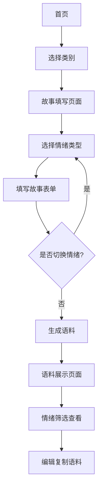

# 雅思串题助手 - 情绪分类故事填写功能需求文档

## 1. 产品概述

雅思串题助手情绪分类故事填写功能是对现有表单系统的重要升级，旨在支持用户为每个类别填写正面印象和负面印象两种故事，以精准对应题库中的正向题目（51道）和负向题目（8道），提升语料生成的针对性和适用性。

该功能通过情绪化故事数据，先生成基础通用语料，再基于通用语料调整适配具体题型和情绪类别，实现更精准的个性化语料输出。

## 2. 核心功能

### 2.1 用户角色
本功能面向所有雅思考生用户，无需角色区分，所有用户均可使用完整功能。

### 2.2 功能模块

本需求涉及以下主要页面的功能扩展：

1. **故事填写页面**：支持情绪切换的双故事填写界面
2. **语料生成页面**：基于情绪分类的智能语料生成
3. **语料展示页面**：情绪化语料的分类展示和管理

### 2.3 页面详情

| 页面名称 | 模块名称 | 功能描述 |
|---------|----------|----------|
| 故事填写页面 | 情绪切换器 | 提供正面/负面印象故事的标签页切换，显示填写状态和进度 |
| 故事填写页面 | 双表单系统 | 支持同一类别下两种情绪故事的独立填写、验证和保存 |
| 故事填写页面 | 智能状态管理 | 自动保存草稿、表单验证、数据同步和错误提示 |
| 语料生成页面 | 情绪化生成引擎 | 基于用户选择的情绪故事，调用AI生成对应情绪色彩的语料内容 |
| 语料生成页面 | 分步生成流程 | 先生成通用语料，再基于通用语料调整生成扣题语料 |
| 语料展示页面 | 情绪筛选器 | 提供全部/正面/负面语料的筛选查看功能 |
| 语料展示页面 | 分类展示区 | 按情绪类别分组展示语料，支持编辑、复制和管理操作 |

## 3. 核心流程

### 3.1 用户操作流程

**情绪化故事填写流程：**
用户进入类别页面 → 选择情绪类型（正面/负面） → 填写对应情绪的故事表单 → 保存草稿或切换情绪继续填写 → 完成后点击生成语料 → 系统验证表单完整性 → 跳转到语料生成页面

**智能语料生成流程：**
系统检测用户已填写的情绪故事类型 → 为每种情绪分别生成通用语料 → 获取对应情绪的题目列表 → 基于通用语料为每个题目生成扣题语料 → 保存生成结果 → 展示语料内容

**语料管理流程：**
用户查看生成的语料 → 使用情绪筛选器选择查看类型 → 浏览分类展示的语料内容 → 进行编辑、复制或删除操作 → 系统同步更新数据



## 4. 用户界面设计

### 4.1 设计风格

- **主色调**：保持现有的蓝色主题（#3B82F6），新增情绪色彩标识
  - 正面情绪：温暖绿色（#10B981）
  - 负面情绪：柔和橙色（#F59E0B）
- **按钮样式**：圆角设计，支持情绪状态的视觉反馈
- **字体**：Inter字体，14px为主要字号，12px为辅助信息
- **布局风格**：卡片式布局，顶部标签页导航
- **图标风格**：使用Lucide图标库，新增情绪表情图标

### 4.2 页面设计概览

| 页面名称 | 模块名称 | UI元素 |
|---------|----------|--------|
| 故事填写页面 | 情绪切换器 | 顶部标签页设计，正面/负面标签，填写状态指示器（已填写/未填写），进度显示（如：5/7字段） |
| 故事填写页面 | 表单区域 | 动态表单字段，实时验证提示，保存草稿按钮，生成语料按钮，错误信息展示 |
| 语料生成页面 | 生成状态 | 加载动画，进度条，生成步骤提示，错误处理界面 |
| 语料展示页面 | 筛选器 | 水平标签页（全部/正面/负面），语料数量统计，搜索框 |
| 语料展示页面 | 语料卡片 | 情绪标识图标，语料内容预览，编辑/复制/删除按钮，时间戳显示 |

### 4.3 响应式设计

产品采用移动优先的响应式设计，支持桌面端和移动端的良好体验：

- **桌面端**：标签页横向排列，表单双列布局，语料卡片网格展示
- **移动端**：标签页保持横向，表单单列布局，语料卡片垂直堆叠
- **触摸优化**：按钮最小点击区域44px，支持滑动切换标签页

## 5. 技术实现要点

### 5.1 数据结构变更

```typescript
// 核心数据结构调整
interface SentimentStoryData {
  positive?: Record<string, string>;  // 正面印象故事
  negative?: Record<string, string>;  // 负面印象故事
}

interface UserStory {
  id: string;
  category: CategoryType;
  storyData: SentimentStoryData;  // 支持双情绪数据
  createdAt: Date;
  updatedAt: Date;
}
```

### 5.2 状态管理策略

- **表单状态**：使用Zustand管理双表单的独立状态
- **验证逻辑**：分别验证正面和负面故事的完整性
- **数据持久化**：LocalStorage支持情绪分类数据的存储

### 5.3 AI生成优化

- **分步生成**：先生成通用语料，再基于通用语料调整扣题语料
- **情绪适配**：提示词模板针对正面/负面情绪进行优化
- **质量保证**：增加生成内容的情绪一致性检查

## 6. 验收标准

### 6.1 功能验收

- [ ] 用户可以为每个类别填写正面和负面两种故事
- [ ] 情绪切换功能正常，数据不丢失
- [ ] 表单验证分别针对两种情绪进行
- [ ] 语料生成基于用户选择的情绪故事
- [ ] 生成的语料体现对应的情绪色彩
- [ ] 语料展示支持情绪筛选和分类查看

### 6.2 性能验收

- [ ] 情绪切换响应时间 < 200ms
- [ ] 表单数据保存响应时间 < 500ms
- [ ] 语料生成完成时间 < 30s（包含AI调用）
- [ ] 页面加载时间 < 2s

### 6.3 用户体验验收

- [ ] 界面直观易懂，情绪切换逻辑清晰
- [ ] 填写状态和进度提示准确
- [ ] 错误信息友好且具有指导性
- [ ] 移动端和桌面端体验一致

## 7. 风险评估

### 7.1 技术风险

- **数据迁移风险**：现有用户数据需要平滑迁移到新结构
- **AI生成质量**：情绪化语料的生成质量需要持续优化
- **性能影响**：双表单和双语料可能增加系统负载

### 7.2 用户体验风险

- **学习成本**：新功能可能增加用户的学习成本
- **操作复杂度**：双情绪管理可能让界面变得复杂
- **数据丢失**：情绪切换时可能出现数据丢失

### 7.3 缓解措施

- 实施渐进式发布，先支持现有功能，再逐步开放新功能
- 提供详细的用户引导和帮助文档
- 增加数据备份和恢复机制
- 进行充分的用户测试和反馈收集

## 8. 后续优化方向

### 8.1 智能推荐

- 基于用户填写的故事内容，智能推荐适合的题目
- 分析用户的情绪偏好，提供个性化的填写建议

### 8.2 语料质量提升

- 增加语料评分机制，帮助用户了解语料质量
- 提供语料优化建议和改进方向

### 8.3 社交功能

- 支持用户分享优质语料模板
- 建立语料评价和点赞系统

### 8.4 数据分析

- 统计用户的情绪故事填写偏好
- 分析不同情绪语料的使用效果
- 为产品优化提供数据支持